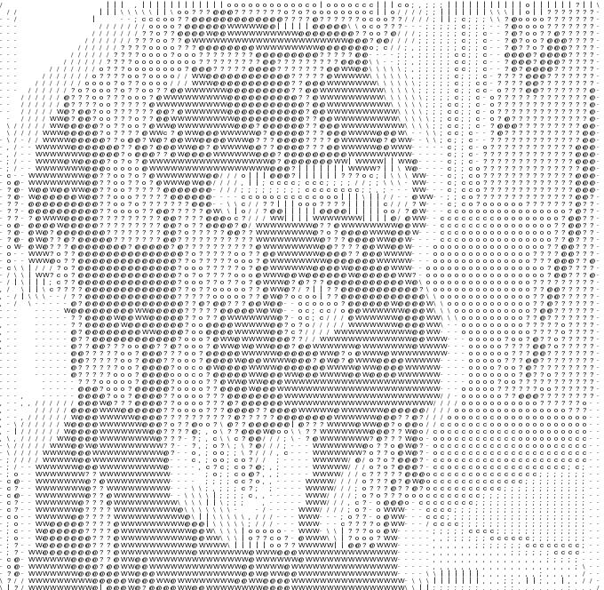

# ASCII-filt

Turn any image into ASCII art.

## Current Results




## Installation

The project only depends on NumPy and Python PILLOW to aid
in the image processing.

```bash
git clone https://github.com/znataniel/asciifilt.git
cd asciifilt
python -m venv ./env
source ./env/bin/activate
pip install -r requierements.txt
```

## Usage

Just pass in the image you want to transform!

The output will be on `./out.jpg`


```bash
source ./env/bin/activate
asciifilt path/to/image
```
